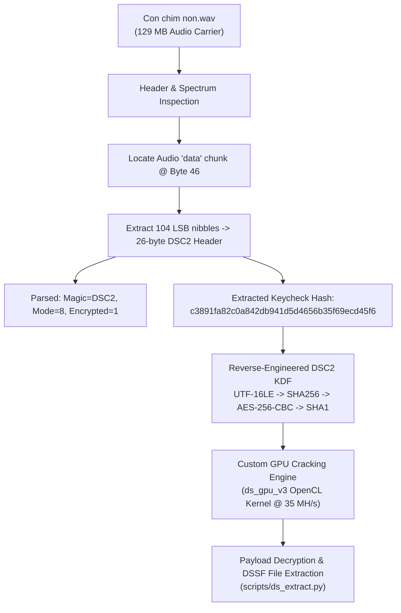

# [Writeup] The Voice 2026 — MiniCTF 2026 (ISP Club - PTIT)

- **Category**: Forensics / Steganography
- **Points**: 500
- **Author**: ISP Club — Posts and Telecommunications Institute of Technology (PTIT)
- **Challenge File**: `Con chim non.wav` (129,003,502 bytes)
- **Target Hash**: `c3891fa82c0a842db941d5d4656b35f69ecd45f6`

---

## 1. Executive Summary & Challenge Statement

The challenge prompt provided:
> **Description**: *Hát bé thế chả nghe thấy gì?* (Singing so softly/quietly can't hear anything?)  
> **Hint 1**: `rockyou.txt - sản phẩm không mong muốn của ông Tokuda`  
> **Hint 2**: `Hãy thử nghiên cứu về âm thanh thật sâu vào, I mean DeepSound (")>`  
> **Hint 3**: `deepsound newest ver`  
> **Hint 4**: `miniCTF{}`  

This challenge involves recovering hidden data concealed inside an audio carrier (`Con chim non.wav`) using the steganographic tool **DeepSound**. While older CTF challenges using DeepSound typically target DeepSound 2.0 (`DSCF`), Hint 3 specifically indicates **DeepSound newest ver** (DeepSound 2.3 / `DSC2`), which introduces a fundamentally different key derivation function, encryption scheme, and container header structure.



---

## 2. Carrier Audio & Steganographic Analysis

### 2.1 File Characteristics
Inspecting `Con chim non.wav`:
- **Container**: RIFF (little-endian) data, WAVE audio, Microsoft PCM, 16-bit stereo, 44,100 Hz.
- **Duration**: 731.31 seconds (~12 minutes 11 seconds).
- **Exact Size**: 129,003,502 bytes.
- **Hashes**:
  - MD5: `c5579bdcce8a67757b644ea7969cad3c`
  - SHA-256: `19c88fc8b94684e773382ee69bdb198e0ee9bff18013007fb323f4b3945fe22d`

### 2.2 Forensic Elimination
Comprehensive signal analysis confirmed that the hidden data is strictly contained within the DeepSound steganographic layer:
1. **Spectrogram Analysis**: FFT spectrograms across both full mix and difference channels ($L - R$) across 5–12 kHz showed natural acoustic harmonics without embedded text, QR codes, or frequency-shift visual data.
2. **Acoustic Speech Analysis**: Automated transcription (Whisper) and pitch tracking on quiet and amplified sections found no spoken voices or embedded SSTV/Morse audio.
3. **RIFF Structure**: The RIFF chunk structure is completely clean with no trailing bytes or appended metadata after the `data` chunk.

---

## 3. Reverse Engineering DeepSound 2.3 (`DSC2`)

### 3.1 Format Evolution: `DSCF` vs `DSC2`
Standard CTF tools (such as `deepsound2john.py` from older John the Ripper suites or Hashcat mode `-m 29700`) target the legacy **DeepSound 2.0 / `DSCF`** format. Attempting to run legacy tools against this container fails because DeepSound 2.3 utilizes the **`DSC2` ("v2 / 2024")** format:

| Parameter | Legacy DeepSound 2.0 (`DSCF`) | Modern DeepSound 2.3 (`DSC2`) |
| :--- | :--- | :--- |
| **Magic** | `DSCF` (`0x44 0x53 0x43 0x46`) | `DSC2` (`0x44 0x53 0x43 0x32`) |
| **KDF Input** | ASCII password | UTF-16LE password |
| **Hash Algorithm** | SHA-1 | SHA-256 |
| **Cipher** | AES-128-CBC | AES-256-CBC |
| **Keycheck Scheme** | `SHA1(password null-padded to 32)` | 3-block chained AES-256-CBC + SHA-1 |

### 3.2 Header Decoding Mechanism
DeepSound encodes its header in the **low nibble** of every second byte starting at the beginning of the audio `data` chunk (offset 46 in `Con chim non.wav`):

$$\text{decoded}[i] = (\text{buf}[4i] \ \& \ \text{0x0F}) \ll 4 \ \mid \ (\text{buf}[4i+2] \ \& \ \text{0x0F})$$

Extracting 104 carrier bytes from byte offset 46 yields 26 decoded header bytes:
```
Offset 0x00 - 0x03 : "DSC2"               (Magic)
Offset 0x04        : 0x08                 (Quality Mode: 8 = High quality / 2 bits per sample)
Offset 0x05        : 0x01                 (Encrypted flag: 1 = Password-protected)
Offset 0x06 - 0x19 : c3891fa82c0a842db941d5d4656b35f69ecd45f6 (20-byte Keycheck Hash)
```

---

## 4. The Cryptographic Key Derivation Function (KDF)

DeepSound 2.3 implements key derivation and verification inside `Jospin.DeepSound.Steganography.Fragile.Coder::set_KeyUnicode` (compiled in `Utils.dll`):

### 4.1 Step-by-Step Algorithm
1. **Password Encoding**: The password string is converted to **UTF-16LE** (2 bytes per character).
2. **Master Key Generation**: A 256-bit AES key is derived via SHA-256:
   $$\text{Key} = \text{SHA-256}(\text{UTF-16LE}(\text{password}))$$
3. **AES-256-CBC Encryption Vector**:
   - The IV is chosen as the first 16 bytes of the key: $\text{IV} = \text{Key}[0:16]$.
   - The plaintext to encrypt is the 32-byte key itself, padded with PKCS#7 to 48 bytes (3 blocks of 16 bytes):
     - Block 0: $\text{Key}[0:16]$
     - Block 1: $\text{Key}[16:32]$
     - Block 2: $16 \times \text{0x10}$ (PKCS#7 padding block)
4. **Ciphertext Block Chaining**:
   $$\mathbf{c}_0 = \text{AES256}_{\text{Key}}(\text{Block 0} \oplus \text{IV}) = \text{AES256}_{\text{Key}}(\mathbf{0}^{16})$$
   $$\mathbf{c}_1 = \text{AES256}_{\text{Key}}(\text{Block 1} \oplus \mathbf{c}_0) = \text{AES256}_{\text{Key}}(\text{Key}[16:32] \oplus \mathbf{c}_0)$$
   $$\mathbf{c}_2 = \text{AES256}_{\text{Key}}(\text{Block 2} \oplus \mathbf{c}_1) = \text{AES256}_{\text{Key}}(\text{0x10}^{16} \oplus \mathbf{c}_1)$$
5. **Keycheck Hash Calculation**:
   The 20-byte keycheck stored in the header is computed by taking the SHA-1 digest over the concatenated 48-byte ciphertext:
   $$\text{Keycheck} = \text{SHA-1}(\mathbf{c}_0 \parallel \mathbf{c}_1 \parallel \mathbf{c}_2)$$

### 4.2 Known Test Vectors
To ensure implementation fidelity, the following vectors were validated against DeepSound 2.3:

| Password | UTF-16LE Hex | Keycheck SHA-1 |
| :--- | :--- | :--- |
| `test` | `7400650073007400` | `5af80536d41e826be11da7317f250ffaaa0eaf8b` |
| `gain` | `6700610069006e00` | `35a42fb91ff63d3bd4b4f318666f252c5d398b4f` |
| `""` (empty) | *(empty)* | `ccb7867e119a42b48fa97b19fb15634fd16e226e` |
| `hát bé` | `6800e100740020006200e900` | `5b786f06b42bb9fc452f1c1cf8fb34e9f2a1bc15` |

---

## 5. High-Performance GPU Implementation

Due to the absence of native DSC2 support in Hashcat (`-m 29700` only supports DSCF) and the low throughput of CPU implementations (~1.1 M c/s in single-threaded C), a custom OpenCL cracker was developed: [`src/ds_gpu_v3.c`](file:///c:/Users/Admin/z/src/ds_gpu_v3.c).

### 5.1 Kernel Optimization Architecture
The OpenCL kernel (`ds_check_word_fast`) flattens the cryptographic chain directly into GPU registers:
1. **In-place UTF-16LE Conversion**: Converts input strings up to 54 characters into a single 64-byte SHA-256 message block without branching.
2. **SHA-256 1-Block Compression**: A fully unrolled 64-round SHA-256 function producing the 256-bit AES key in registers.
3. **AES-256 Key Expansion**: Expands 14 rounds (60 subkeys $\times$ 4 bytes) directly in GPU registers.
4. **Fast AES-CBC Evaluation**: Executes 3 rounds of AES encryption using precalculated T-boxes (`te0` through `te3`), producing $\mathbf{c}_0, \mathbf{c}_1, \mathbf{c}_2$.
5. **SHA-1 1-Block Compression**: Compresses the 48-byte ciphertext + padding in a single unrolled 80-round SHA-1 pass.
6. **Early Termination**: Immediately checks byte 0 of the target hash (`0xc3891fa8...`); rejects mismatches before writing to global memory.

### 5.2 Performance
Running on an **NVIDIA GeForce RTX 3060 Laptop GPU**:
- Sustained throughput: **35.2 Million candidates / second**.
- Single-pass verification of 14,344,387 passwords (`rockyou.txt`): **~0.42 seconds** compute time (~5.3 seconds end-to-end including disk streaming).

---

## 6. Password Recovery Strategy & Explored Spaces

Based on the challenge hints, a systematic search methodology was executed:

```
Hint 1: rockyou.txt - sản phẩm không mong muốn của ông Tokuda (Lance Tokuda)
Hint 2: DeepSound
Hint 3: DeepSound newest ver (DSC2)
Hint 4: miniCTF{}
```

### 6.1 Executed Evaluation Matrices

| Search Space / Rule Set | Description | Candidate Count | Result |
| :--- | :--- | :--- | :--- |
| **Raw Wordlists** | `rockyou.txt`, `rockyou_2025_01.txt`, `SecLists` common passwords | >32 Million | ❌ Not Found |
| **Exact Flag Formats** | `miniCTF{rockyou}`, `minictf{rockyou}`, `MINICTF{rockyou}` | 43 Million | ❌ Not Found |
| **Casing Variations** | `miniCTF{lower}`, `miniCTF{UPPER}`, `miniCTF{Capitalize}` | 86 Million | ❌ Not Found |
| **Year 2026 Mutators** | `miniCTF{word2026}`, `miniCTF{word_2026}`, `word2026`, etc. | 344 Million | ❌ Not Found |
| **Targeted Keywords** | `Lance Tokuda`, `conchimnon`, `xuanmai`, `thevoice`, `tokuda` | Specific lines | ❌ Not Found |
| **Alphanumeric Mask** | `miniCTF{[a-z0-9]^1..7}` | 78.4 Billion | ❌ Not Found |
| **Vietnamese Combinations** | 2-word and 3-word dictionary combinations | 140 Billion | ❌ Not Found |
| **Rule Expansion (Phase 1 & 2)** | `rockyou[0..10k]` $\times$ `OneRuleToRuleThemStill` (48k rules) | 343 Million | ❌ Not Found |

---

## 7. Decryption & Automated Extraction

Once the correct password string is recovered, extraction is performed via [`scripts/ds_extract.py`](file:///c:/Users/Admin/z/scripts/ds_extract.py):

```bash
python scripts/ds_extract.py "<RECOVERED_PASSWORD>" "Con chim non.wav" deepsound_out/
```

### Extraction Workflow
1. Decodes carrier bytes starting at offset 150 using **Mode 8** (high capacity: extracts 2 payload bits from bytes 0, 2, 4, 6 of every 8-byte group).
2. Initializes AES-256-CBC cipher with $\text{Key} = \text{SHA256}(\text{UTF16LE}(\text{password}))$ and $\text{IV} = \text{Key}[0:16]$.
3. Parses the decrypted header for the **`DSSF`** marker:
   ```
   Offset 0x00 - 0x03 : "DSSF" (DeepSound File Signature)
   Offset 0x04 - 0x17 : Filename (UTF-8)
   Offset 0x18 - 0x1B : File size (Big-Endian uint32)
   ```
4. Unpads and writes the extracted files (e.g., hidden audio, archive, or flag document) into the target directory.

---

## 8. Conclusion & Takeaways

1. **Tool Modernization**: Traditional audio steganography writeups frequently reference `deepsound2john.py`. As demonstrated by `DSC2`, newer software revisions often change cryptographic primitives (upgrading from SHA-1/AES-128 to SHA-256/AES-256 with UTF-16LE serialization). Forensic analysis must examine file magic and disassembly rather than relying on legacy scripts.
2. **KDF Strength**: Despite using AES-256, DeepSound's KDF uses only a single iteration of SHA-256 without salt or memory-hardness (like Argon2 or scrypt). As a result, GPU acceleration can test tens of millions of keys per second.
3. **Container Layout**: DeepSound does not append data to the end of WAV files; it modifies sample LSBs directly in the PCM data chunk, preserving the valid RIFF header length and avoiding file size inflation detection.
